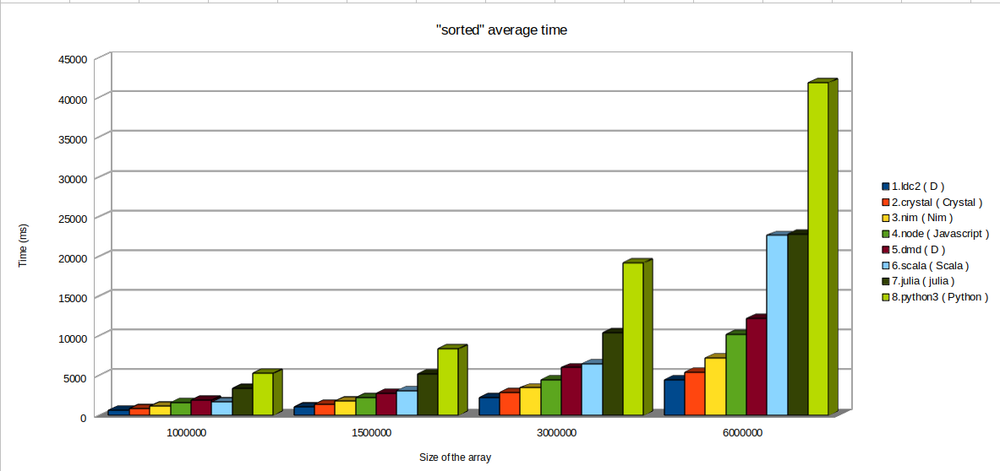

# expressive sort

In this quora [answere](https://es.quora.com/Por-qu%C3%A9-la-mayor%C3%ADa-de-los-desarrolladores-estudian-solo-lenguajes-muy-simples-como-JavaScript-y-Python-en-lugar-de-aprender-un-lenguaje-verdadero-como-C-2/answer/Antonio-Cabrera-52) I wrote about javascript/python expressiveness vs Go/Rust/D/... performance.

As an example, I mentioned the "3 lines" haskell quick sort and wrote this javascript version

```javascript
const sorted = ([pivot, ...others]) => pivot === void 0 ? [] : [
  ...sorted(others.filter(n => n < pivot)),
  pivot,
  ...sorted(others.filter(n => n >= pivot))
];
```

This, of course, is not a "quick sort" because the original one is an "in place" algorithm that doesn't require additional memory space allocation.  This is a functional oriented expression that exemplarizes how expressive a "functional" orientation can be (You "express" that the sorted version of an array is, given one of it's elements, the sorted version of the smaller ones, plus the item, plus the sorted version of the bigger ones).

As an enthusiastic newbie to the "[D](https://dlang.org)" programming language, I thought that D could affort this expressiveness too...

D has no support for destructuring as javascript has (remember de ```sorted([pivot, ...others])```), but it has **lambdas**, **map/filter/reduce** support, **array slices** and **array concatenation** that allows you to write easily a similar expression:

```d
T[] sorted(T)(T[] xs)
{
  return xs.length == 0 ? [] : 
    xs[1..$].filter!(x=> x < xs[0]).array.sorted ~ 
    xs[0..1] ~ 
    xs[1..$].filter!(x=> x >= xs[0]).array.sorted;
}

```

> **note**:  D notation allows to write **foo(a)** as **a.foo()** or **a.foo**, this is the reason we can write *sorted( array( something ) )* as *something.array.sorted*
>
> **note**: **sorted** is a *templated method* (**T** is the type of the elements of the array): "under the scenes", D compiler detects if the final used type is comparable (i.e.:  it is a class with a **opCmp** method, or it is a numerical type, or ...):  yo don't need to tell that T extends something like *"IComparable"* because D libraries are not "interface" based:  D prefers to use "conventions" and check them using instrospection at compile time (D developers write compile-time code and run-time code at the same time:  D allows you to mix them naturally).

Seeing the similarities, I assume (I really don't know) that javascript and D versions are doing the same "under the scenes":

* The ```[...array1, ...array2, ...array3]``` javascript is equivalent to the ```array1 ~ array2 ~ array3``` D code.  That is, a new array is being generated as a result of copying the elements of the original 3.
* The ```.filter!(...).array``` D code is using a "Range" to filter the elements and the ".array()" method to materialize the selected elements as an array.  Internally, it is similar to the javascript code where ```.filter(...)``` iterates and selects the resulting elements and finally materializes the array

## Wich one will perform better?

First surprise was Javascript (nodejs) version performs better than D (about **20% faster for 1_000_000 random Float64 numbers**).

* Javascript (**node**):  **1610 ms**
* D (**DMD compiler**):  **2017 ms**

Fortunately, D has 3 compilers: DMD (official reference compiler), GDC (GCC based compiler) and LDC (LLVM based compiler).

* D (**LDC compiler**):  **693 ms** !!!

That's speed :-)

I decided to write similar code in other languajes to compare.

In Python:

```python
def sorted(xs):
  return [] if len(xs) == 0 else \
    sorted([x for x in xs[1:] if x < xs[0]]) + \
    xs[0:1] + \
    sorted([x for x in xs[1:] if x >= xs[0]])
```

In Crystal:

```ruby
def sorted(xs : Array(Float64)) : Array(Float64)
  return xs.size == 0 ? [] of Float64  :
    sorted(x[1..].select { |x| x < xs[0] }) +
    [ xs[0] ] +
    sorted(xs[1..].select { |x| x >= xs[0] })
end
```

In Julia (thanks to [Camilo Chacón Sartori](https://github.com/camilochs))

```julia
function sorted(xs::Array{Float64, 1})::Array{Float64, 1}
  return length(xs) == 0 ? Array{Float64, 1}() : vcat(
    sorted([x for x in xs[2:end] if x < xs[1]]),
    xs[1],
    sorted([x for x in xs[2:end] if x >= xs[1]])
  )
end
```

In Scala

```scala
def sorted( xs:List[Double] ): List[Double] =
  xs match {
    case Nil =>
      List()
    case pivot :: rest =>
      sorted( rest.filter( _ < pivot ) ) ++
      List(pivot) ++
      sorted( rest.filter( _ >= pivot ) )
  }
```

In Nim

```nim
func sorted[T](xs:seq[T]): seq[T] = 
  if xs.len==0: @[] else: concat(
    xs[1..^1].filter(x=>x<xs[0]).sorted,
    @[xs[0]],
    xs[1..^1].filter(x=>x>=xs[0]).sorted
  )
```

For better measurement, each test is internally ran 5 times, each time with a newly generated set of numbers (to avoid run-to-run optimization effects).

The results, as CSV, are

```csv
compiler,lang,size,ms
"ldc2","D",1000000,693
"ldc2","D",1500000,1049
"ldc2","D",3000000,2232
"ldc2","D",6000000,4491
"crystal","Crystal",1000000,821
"crystal","Crystal",1500000,1389
"crystal","Crystal",3000000,2891
"crystal","Crystal",6000000,5454
"nim","Nim",1000000,1149
"nim","Nim",1500000,1795
"nim","Nim",3000000,3456
"nim","Nim",6000000,7260
"node","Javascript",1000000,1634
"node","Javascript",1500000,2227
"node","Javascript",3000000,4509
"node","Javascript",6000000,10172
"dmd","D",1000000,1927
"dmd","D",1500000,2800
"dmd","D",3000000,6002
"dmd","D",6000000,12206
"scala","Scala",1000000,1678
"scala","Scala",1500000,3128
"scala","Scala",3000000,6522
"scala","Scala",6000000,22633
"julia","julia",1000000,3378
"julia","julia",1500000,5246
"julia","julia",3000000,10357
"julia","julia",6000000,22813
"python3","Python",1000000,5316
"python3","Python",1500000,8382
"python3","Python",3000000,19206
"python3","Python",6000000,41887
```

Execution time histogram by array size:



Changing to logaritmic scale


## Do you know how to improve?

I include the code to the 4 tests.  Please, tell me if you see something we can improve:

* Avoid imperative instructions:  "sorted" must be an unique expression or, at least, an unique "return ..." statement funcion.
* Of course, you can't use built-in library sort methods :-)
* Remember that this is not a quick-sort performance test (that, obviously, can be implemented in a more efficient way)

## Running the tests

### Prerequisites

All tests have been executed on a Ubuntu 20.04 linux.

Tests require **Nodejs**, **Python3**, **Julia**, **DMD**/**LDC** for D, **scala**, **Nim** and **Crystal** compilers

* **Nodejs**:  I use node 12.20 (see [NodeSource distributions](https://github.com/nodesource/distributions/blob/master/README.md) for more information)
* **Python3**:  Ubuntu comes with **python 3** preinstalled.
* **Julia**: It is available in apt and snap repositories.  The apt version is newest (but not latest). See [download page](https://julialang.org/downloads/) for newest versions

```shell
$ sudo apt install julia
```

* **DMD** and **LDC**:  They are available in **apt**  and **snap** repositories (see [guide](https://dlang.org/download.html) ) .  Because **ldc** version is newest in snap, I use snap repos:

```shell
$ snap install dmd --classic
$ snap install ldc2 --classic
```
* **scala** 2.11.12: It is availabe in **apt** repository
```shell
$ sudo apt install scala
```

* **Crystal**: It is availabe in **apt** and **snap** repositories  (see [guide](https://crystal-lang.org/install/on_ubuntu/) for more information )


### Running

You can run all tests using ``test.sh``

```shell
$ ./test.sh 
```

If no want to generate a ``result.csv`` file

```shell
$ ./test.sh | tee result.csv
```

If you prefer to run tests individually:

* D (LDC)

```shell
$ ldc2 -O5 -release -enable-cross-module-inlining --run sorted.d 
```

* D (DMD)

```shell
$ dmd -O -release -run sorted.d
```

* Javascript

```shell
$ node sorted.js
```

* Crystal

```shell
$ crystal run sorted.cr --release
```

* Python

```shell
$ python3 -OO sorted.py
```

* Julia

```shell
julia -O3 --inline=yes --check-bounds=no sorted.jl
```

## thanks to

* [Camilo Chacón Sartori](https://github.com/camilochs) For the Julia code
* [Max Haughton](https://github.com/maxhaton) For the proper DMD/LDC optimisation settings
