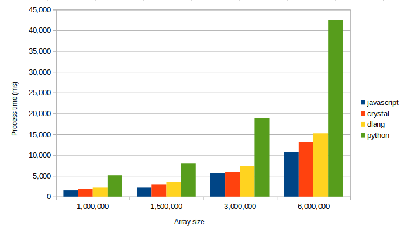

# expressive_sort

In this quora [answere](https://es.quora.com/Por-qu%C3%A9-la-mayor%C3%ADa-de-los-desarrolladores-estudian-solo-lenguajes-muy-simples-como-JavaScript-y-Python-en-lugar-de-aprender-un-lenguaje-verdadero-como-C-2/answer/Antonio-Cabrera-52) I wrote about javascript/python expressiveness vs Go/Rust/D/... performance.

As an example, I mentioned the "3 lines" haskell quick sort and wrote this javascript version

```javascript
const sorted = ([pivot, ...others]) => pivot === void 0 ? [] : [
  ...sorted(others.filter(n => n < pivot)),
  pivot,
  ...sorted(others.filter(n => n >= pivot))
];
```

This, of course, is not a "quick sort" because the original one is an "in place" algorithm that doesn't require additional memory space allocation.  This is a functional oriented expression that exemplarizes how expressive a "functional" orientation can be (You "express" that the sorted version of an array is, given one of it's elements, the sorted version of the smaller ones, plus the item, plus the sorted version of the bigger ones).

As an enthusiastic newbie to the "[D](https://dlang.org)" programming language, I thought that D could affort this expressiveness too...

D has no support for destructuring as javascript has (remember de ```sorted([pivot, ...others])```), but it has **lambdas**, **map/filter/reduce** support, **array slices** and **array concatenation** that allows you to write easily a similar expression:

```d
T[] sorted(T)(T[] xs)
{
  return xs.length == 0 ? [] : 
    xs[1 .. $].filter!(x=> x < xs[0]) .array.sorted ~ 
    xs[0 .. 1] ~ 
    xs[1 .. $].filter!(x=> x >= xs[0]).array.sorted;
}

```

> **note**:  D notation allows to write **foo(a)** as **a.foo()** or **a.foo**, this is the reason we can write *sorted( array( something ) )* as *something.array.sorted*
>
> **note**: **sorted** is a *templated method* (**T** is the type of the elements of the array): "under the scenes", D compiler detects if the final used type is comparable (i.e.:  it is a class with a **opCmp** method, or it is a numerical type, or ...):  yo don't need to tell that T extends something like *"IComparable"* because D libraries are not "interface" based:  D prefers to use "conventions" and check them using instrospection at compile time (D developers write compile-time code and run-time code at the same time:  D allows you to mix them naturally).

Seeing the similarities, I assume (I really don't know) that javascript and D versions are doing the same "under the scenes":

* The ```[...array1, ...array2, ...array3]``` javascript is equivalent to the ```array1 ~ array2 ~ array3``` D code.  That is, a new array is being generated as a result of copying the elements of the original 3.
* The ```.filter!(...).array``` D code is using a "Range" to filter the elements and the ".array()" method to materialize the selected elements as an array.  Internally, it is similar to the javascript code where ```.filter(...)``` iterates and selects the resulting elements and finally materializes the array

## Wich one will perform better?

Here comes the surprise (at least for me):  Javascript version performs better than D version (about **30% faster for 1_000_000 random Float64 numbers**).

* Javascript (node):  **1610 ms**
* D (DMD compiler):  **2017 ms**

Main problem is DMD compiler (compiles fast, but resulting executable is poorly optimized).  A good alternative is the **lcd2** compiler that generates can generate optimized binaries

* D (LDC2 compiler):  **772 ms**

I decided to write similar code in other languajes and compare.

In python:

```python
def sorted(items):
  return [] if len(items) == 0 else \
    sorted([item for item in items[1:] if item < items[0]]) + \
    items[0:1] + \
    sorted([item for item in items[1:] if item >= items[0]])
```

In crystal:

```ruby
def sorted(a : Array(Float64)) : Array(Float64)
  return a.size == 0 ? [] of Float64  :
    sorted(a[1..].select { |x| x < a[0] }) +
    [ a[0] ] +
    sorted(a[1..].select { |x| x >= a[0] })
end
```

The resulting final table for different sets of data



```
D (DMD)
1.0M: 1838 ms
1.5M: 2833 ms
3.0M: 5885 ms
6.0M: 12016 ms
D (LCD)
1.0M: 665 ms
1.5M: 1074 ms
3.0M: 2234 ms
6.0M: 4500 ms
Crystal
1.0M: 771.0 ms
1.5M: 1152.0 ms
3.0M: 2321.0 ms
6.0M: 4772.0 ms
javascript (node)
1.0M: 1342 ms
1.5M: 2119.6 ms
3.0M: 5187.2 ms
6.0M: 9785.2 ms
python
1.0M: 4509 ms
1.5M: 7691 ms
3.0M: 19277 ms
6.0M: 42620 ms

```

## Do you know how to improve?

I include the code to the 4 tests.  Please, tell me if you see something we can improve:

* Avoid imperative instructions:  "sorted" must be an unique expression or, at least, an unique "return ..." statement funcion.
* Of course, you can't use built-in library sort methods :-)
* Remember that this is not a quick-sort performance test (that, obviously, can be implemented in a more efficient way)

## Running the tests

### Prerequisites

All tests has been executed on a Ubuntu 20.04 linux.

Tests require **Nodejs**, **Python3**, **DMD**/**LDC** D compilers and **Crystal** compiler

**Javascript**:  Test runs on Node, I use node 12.20 (see [NodeSource distributions](https://github.com/nodesource/distributions/blob/master/README.md) for more information)

**Python**:  Ubuntu comes with **python 3** preinstalled.

**D**:  We use **DMD** and **LDC** compilers. They are available in **apt**  and **snap** repositories (see [guide](https://dlang.org/download.html) ) **.

Because ldc2 version is newest in snap, I use snap repos:

```shell
$ snap install dmd --classic
$ snap install ldc2 --classic
```

**Crystal**: It is avaialbe in **apt** and **snap** repositories  (see [guide](https://crystal-lang.org/install/on_ubuntu/) for more information )

### Running

You can run all tests using ``test.sh``

```shell
$ ./test.sh
```

Or test them individually

**D (LDC)**

```shell
$ ldc2 -O5 -release -enable-cross-module-inlining --run sorted.d 
```

**D (DMD)**

```shell
$ dmd -O -release -run sorted.d
```

**Javascript**

```shell
$ node sorted.js
```

**Crystal**

```shell
$ crystal run sorted.cr --release
```

**Python**

```shell
$ python3 sorted.py
```

```

```
